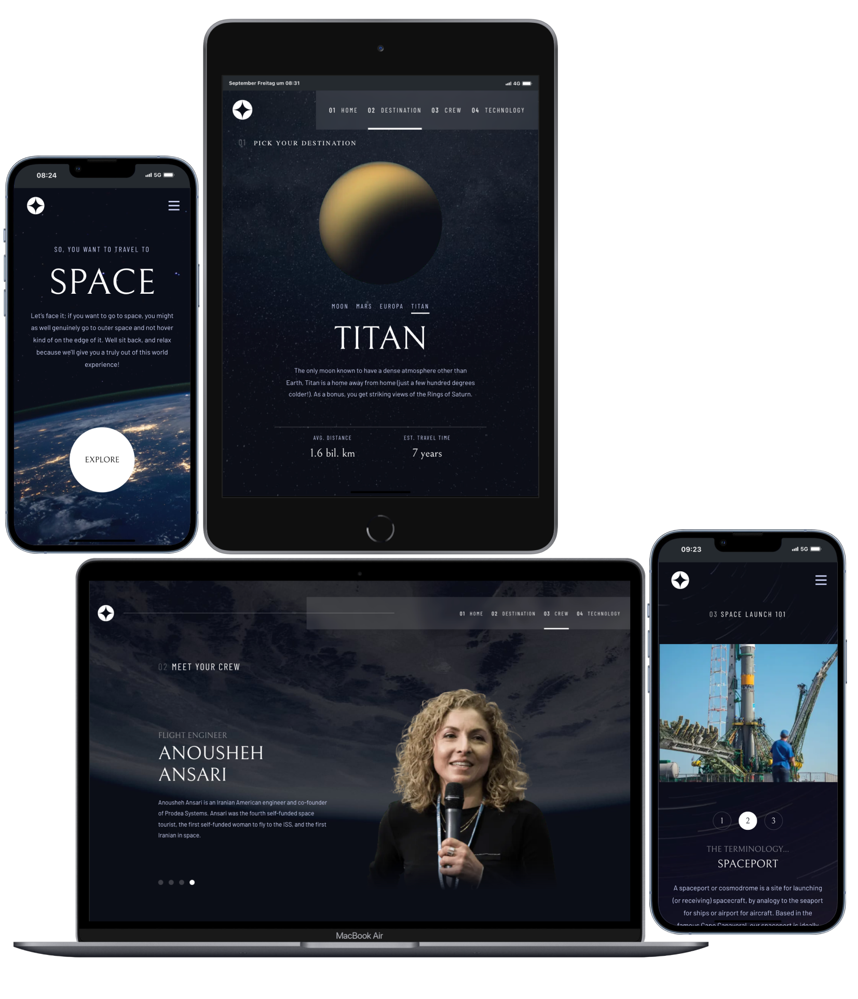

# Frontend Mentor - Space tourism website solution

Here is my solution to the [Space tourism website challenge on Frontend Mentor](https://www.frontendmentor.io/challenges/space-tourism-multipage-website-gRWj1URZ3)

Frontend Mentor provided me with professional Figma Designs, data in JSON and pictures.

### The Challenge

Users should be able to:

- View the optimal layout for each of the website's pages depending on their device's screen size
- See hover states for all interactive elements on the page
- View each page and be able to toggle between the tabs to see new information

I added some extra features on my behalf:

- swipe on mobiles to switch between sub-menus
- button feedback on mobiles when there is no hover
- global page transitions

## Screenshots

### Links

- Live Site URL: [Space Website](https://space-website-gamma.vercel.app/)

### Built with

- [Next.js](https://nextjs.org/) 14.2.7 - App Router
  - including [React](https://react.dev/)
- [Styled Components](https://styled-components.com/) - For styles
- [Framer-Motion](https://www.framer.com/motion/) for page transitions
- Mobile-first workflow
- Flexbox
- Deployed over [Vercel](https://vercel.com/)
